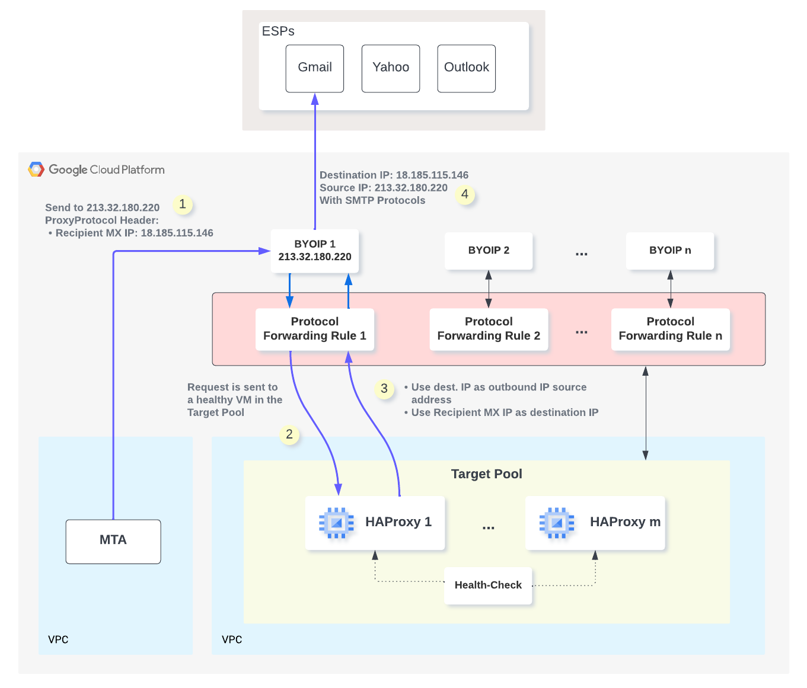

# Deploying an infrastructure to support sending email at scale with redundancy


This document provides instructions on how to deploy the example implementation of an emailing sending cluster based on Protocol Forwarding Rules and Bring Your Own IPs using [Terraform](https://www.terraform.io/).
This implementation is described in more detailed in [this page](TODO)

This pattern is based on [Protocol Forwarding Rules](https://cloud.google.com/load-balancing/docs/protocol-forwarding)  

**This design can support from 1 to 500 Public IP addresses. Pricing is linear with the number of Public IP addresses and above this limit, it will be more costly than the design described [here](https://github.com/fabloc/email-sending-at-scale-with-gcp)**

The following diagram shows the architecture that you deploy. It consists of a Target Pool containing a specified number of instances (default is 2) with Nginx deployed that will act as a relay for requests coming from an MTA (not part of the deployment). Traffic coming in and from the Target Pool instances is routed to a number of public IP addresses using Protocol Forwarding Rules. The public IP addresses can be Dedicated Public IP Addresses assigned by GCP or Bring Your Own IP Addresses (IP type is selected using a boolean flag).
Protocol Forwarding Rules are used to work around a GCP limitations that prevents multiple public IP addresses to be bound to a single VM.

The Nginx deployed in this yerraform deployment is configured to demonstrate only the bidirectionnal communication for instances inside the Target Pool using the Protocol Forwarding Rule.

In order to relay only outbound email sent from MTA, the nginx should be configured properly using:
- A proxy_pass directive to send the email to the proper ESP found in the MTA request (as a custom header for example)
- A proxy_bind directive in order to use the MTA destination address as the source IP address for the request to the ESP 



## Objectives
Provision the following resources in Google Cloud by using a Terraform template:
* One VPC network and subnetwork that connects all resources
* A Target Pool containing a specified number of VMs (2 at least for redundancy), each VM running Nginx serving a basic web page
* A Compute Engine instance used as an internal client
* A set of firewall rules to:
  - Allow the client VM to reach the nginx instances using HTTP
  - Allow connecting to the instances by using [SSH through IAP](https://cloud.google.com/iap/docs/using-tcp-forwarding#tunneling_ssh_connections)


## Costs
This tutorial uses billable components of Google Cloud:
* Instances: [Compute Engine](https://cloud.google.com/compute/all-pricing)
* VM-to-VM traffic is charged when using the public IP address (even though it does not leave the datacenter): [Virtual Private Cloud](https://cloud.google.com/vpc/network-pricing#vpc-pricing)
* Protocol Forwarding Rules are charged per unit: [Cloud Load-Balancing](https://cloud.google.com/vpc/network-pricing#lb)
* Internet Egress Traffic: All outgoing traffic from our datacenter is billed to the customer as described here: [Virtual Private Cloud](https://cloud.google.com/vpc/network-pricing#vpc-pricing). Internet traffic can be [Standard Tier](https://cloud.google.com/network-tiers/docs/overview#standard_tier) or [Premium Tier](https://cloud.google.com/network-tiers/docs/overview#premium_tier)
* Cloud NAT: [Cloud Nat](https://cloud.google.com/vpc/network-pricing#nat-pricing)

To generate a cost estimate based on your projected usage, use the [pricing calculator](https://cloud.google.com/products/calculator).

When you finish this tutorial, you can avoid continued billing by deleting the resources you created. For more information, see [Cleaning up](#Cleaning-up).

## Before you begin

1. In the Google Cloud Console, on the [project selector page](https://console.cloud.google.com/projectselector2/home/dashboard), select or create a Google Cloud project.

1. Make sure that billing is enabled for your Cloud project. Learn [how to confirm that billing is enabled for your project](https://cloud.google.com/billing/docs/how-to/modify-project#confirm_billing_is_enabled_on_a_project).

## Prepare your environment
You can complete this tutorial using [Cloud Shell](https://cloud.google.com/shell/docs) or your local host. Cloud Shell has Terraform pre-installed and set up to authenticate with Google Cloud.

1. (Optional) [Activate Cloud Shell](https://console.cloud.google.com/?cloudshell=true).

1. If you don't use Cloud Shell, install the required components unless they are already installed on your local host:

   * [Install Terraform](https://learn.hashicorp.com/tutorials/terraform/install-cli) version 0.15.0 or later.

   * [Install Google Cloud SDK](https://cloud.google.com/sdk/docs/install).

1. Authenticate to Google Cloud by running `gcloud auth application-default login`. Alternatively use a service account as described in the [Terraform Google provider documentation](https://registry.terraform.io/providers/hashicorp/google/latest/docs/guides/provider_reference#authentication).

1. If not already done, clone this repository to your local host or Cloud Shell by running `git clone https://github.com/GoogleCloudPlatform/floating-ip-patterns.git`.

## Configuring the Terraform variables
The Terraform code that you downloaded includes variables that you can use to customize the deployment based on your requirements. For example, you can adjust the subnet CIDR ranges and specify the project where the resources should be deployed.

You can see the variables of this example in the `variables.tf` file or in the [following table](#variables).

1. In the code that you downloaded, enter the `gcp-sending-emails-at-scale` subdirectory: `cd gcp-ha-with-protocol-forwarding`.

1. Identify the variables for which you need to assign values:

   * Variables that don't have a default value (for example, `project_id`).
   * Variables with a default value that you want to change.

      For example, `region` and `zone` are set to deploy all resources in the `europe-west1-b` zone by default, but you can deploy in a [region of your choice](https://cloud.google.com/compute/docs/regions-zones).

1. Create a text file named `terraform.tfvars`.

   Terraform treats any file with this extension as a [variable definitions file](https://www.terraform.io/docs/language/values/variables.html#variable-definitions-tfvars-files).

   If you don't create a `variables.tfvars` file, Terraform uses the default values of the variables, if available. For variables that don't have a default value, Terraform prompts you to enter a value every time you run any Terraform command.

1. In the `terraform.tfvars`  file, assign appropriate values to the variables that you identified earlier.

   Example:
   ```
   region = "europe-west1"
   zone = "europe-west1-b"
   project_id = "my_project"
   use_byoip=true
   ```
   The value that you assign to each variable must match the type of that variable as declared in `variables.tf` or [the following table](#Variables).
1. Initialize Terraform:
   ```
   terraform init
   ```
   Wait until you see the following message:
   ```
   Terraform has been successfully initialized!
   ```
1. Verify that the configuration has no errors:
   ```
   terraform validate
   ```
   If the command returns an error, make the required corrections in the configuration, and run `terraform validate` again.

   Repeat this step until the command returns the following message:
   ```
   Success! The configuration is valid.
   ```
1. Review the resources defined in the configuration:
   ```
   terraform plan -var-file="variables.tfvars"
   ```
   The output lists the resources that Terraform provisions when you apply the configuration.

   If you want to make any changes, edit the configuration, and then run `terraform validate` and `terraform plan` again.


## Provisioning resources
When no further changes are necessary in the configuration, deploy the resources:

1. Run the following command:
   ```
   terraform apply -var-file="variables.tfvars"
   ```
   Terraform displays a list of the resources that will be created.
1. At the prompt to perform the actions, enter `yes`.

   Terraform displays messages showing the progress of the deployment. After all the resources are created, Terraform displays the following message:
   ```
   Apply complete!
   ```

You have now deployed the example implementation for the load balancing with failover and heartbeat-exposed health checks pattern.

## Testing your deployment

### Inbound Traffic & Redundancy
1. In your browser, enter the url `http://[public_ip_address]`
   If successful, you should see the name of the instance handling the request
   If you refresh the page multiple times, you should notice that it is always the same instance that will handle the request.
   Note the instance name `[instance_name]` displayed in the browser
1. In your browser, go to the [VM instances](https://console.cloud.google.com/compute/instances) page for your project in the Google Cloud Console.
2. In the list of virtual machine instances, click *SSH* in the row of the instance named `[instance_name]`.
   A separate window is opened that connects to the example client VM for this deployment.
3. On the client VM, run:
   ```
   # sudo systemctl stop nginx
   # sudo systemctl status nginx
   ```

   You should see that the nginx service is stopped

4. 1. In your browser, enter the url `http://[public_ip_address]` (or refresh the page)
   Around 5-10s after stopping nginx in step 3 (time for the health-check to detect the failing nginx), you should see the name of the instance handling the request. **It should be a different instance than in step 1**
   
Now this means that inbound traffic is working, and that redundancy is provided by the Target Pool through the Health-Check mechanism.

### Outbound Traffic
1. In your browser, go to the [IP Addresses](https://console.cloud.google.com/networking/addresses/list) page for your project in the Google Cloud Console.
2. In the list of IP Addresses, note the address `public_ip_address` of one of the IP addresses with a name starting with `ha-pf-ip` or `ha-pf-byoip` depending on whether you are using Bring-You-Own-IP or GCP provisioned Dedicated External IP addresses.
3. In your browser, go to the [VM instances](https://console.cloud.google.com/compute/instances) page for your project in the Google Cloud Console.
4. In the list of virtual machine instances, click *SSH* in the row of one of the instance with a name starting with `ha-pf-nginx`.
   A separate window is opened that connects to the example client VM for this deployment.
5. On the client VM, run:
   ```
   curl --interface [public_ip_address] ifconfig.me
   ```
   It should send a request to the API ifconfig.me using the public IP address `public_ip_address`. ifconfig.me returns the public IP address used to make the request.
   You should see the `public_ip_address` returned by the service

## Adding, changing or removing resources
To add, change, or remove resources, edit the Terraform configuration, and then run the commands `terraform validate`, `terraform plan`, and `terraform apply`, in that order.


## Cleaning up
To avoid incurring charges to your Google Cloud account for the resources you created in this tutorial, delete all the resources when you don't need them.

1. Run the following command:
   ```
   terraform destroy -var-file="variables.tfvars"
   ```
   Terraform displays a list of the resources that will be destroyed.

1. At the prompt to perform the actions, enter `yes`.

   Terraform displays messages showing the progress. After all the resources are deleted, Terraform displays the following message:
   ```
   Destroy complete!
   ```

## Variables

| Name | Description | Type | Default | Required |
|------|-------------|------|---------|:--------:|
| <a name="input_project_id"></a> [project\_id](#input\_project\_id) | Google Cloud Project ID | `string` | n/a | yes |
| <a name="input_region"></a> [region](#input\_region) | Google Cloud Region used to deploy resources | `string` | `"europe-west1"` | no |
| <a name="input_zone"></a> [zone](#input\_zone) | Google Cloud Zone used to deploy resources | `string` | `"europe-west1-b"` | no |
| <a name="input_subnet_range"></a> [subnet\_range](#input\_subnet\_range) | IP address range used for the subnet | `string` | `"10.100.0.0/16"` | no |
| <a name="nginx_instances_number"></a> [instance\_numbers](#input\_instance_numbers) | Number of Instances to create in the Target Pool - use at least 2 for redundancy | `number` | `2` | no |
| <a name="use_byoip"></a> [use\_byoip](#input\_use\_byoip) | Boolean indicating whether to use BYOIP or dedicated public IPs | `boolean` | n/a | yes |
| <a name="dedicated_ip_number"></a> [ip\_number](#input\_ip\_number) | If not using BYOIP (`use_byoip` set to `false`), number of dedicated public IPs to create | `number` | `5` | no |
| <a name="input_health_check_port"></a> [health\_check\_port](#input\_health\_check\_port) | TCP port used for health check | `number` | `6000` | no |